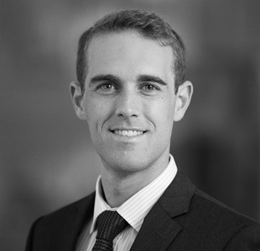

Aside
====================================

{width=80%}

Contact {#contact}
------------------------------------

- <i class="fa fa-envelope"></i> rohan.daniscox@gmail.com
- <i class="fa fa-github"></i> [github.com/RohanDanisCox](http://github.com/RohanDanisCox)
- <i class="fa fa-phone"></i> 0449 638 975

Skills 1 {#skill1}
------------------------------------

- One
- Two
- Three

Programming {#programming}
------------------------------------

- R
- SQL
- Python
- Bash
- CSS

References {#references}
------------------------------------

- <b>Linda Hardy </b> 
- National Australia Bank
- Senior Manager
- UBank Governance & Enablement 
- <i class="fa fa-envelope"></i> Linda.Hardy@nab.com.au
- <i class="fa fa-phone"></i> 0459 844 081

- <b>Annemarie Avis </b> 
- National Australia Bank
- Manager, Quality & Advice Coaching
- <i class="fa fa-envelope"></i> Annemarie.Avis@nab.com.au
- <i class="fa fa-phone"></i> 0477 755 991

Disclaimer
------------------------------------

Made using [**pagedown**](https://github.com/rstudio/pagedown). 

[View Source Code](https://github.com/RohanDanisCox/cv).

Last updated on `r format(Sys.Date(), format = "%d %b %Y")`.

Main
====================================

Rohan Danis-Cox {#title}
------------------------------------

Found my calling to be a data scientist having developed significant range in financial services over the last 8 years. I am close to completing a Master of Data Science and Innovation at UTS and I am looking to demonstrate my skillset. I am a strong critical thinker and problem solver with a continuous improvement mindset.

Education {data-icon=graduation-cap}
------------------------------------

### Master of Data Science and Innovation

University of Technology

Sydney, NSW

2020 - 2017

- [Innovation Lab on NSW Property](https://rohandaniscox.github.io/ilab_2019/index.html)
- GPA 3.92 out of 4

### Advanced Diploma of Financial Planning

Kaplan Professional Education

Online

2014 - 2012

- ASIC RG 146 Compliance

### Bachelor of Finance

Australian National University

Canberra, ACT

2011 - 2007

- GPA 5.54 out of 7

Professional Experience {data-icon=suitcase}
--------------------------------------------------------------------------------

### Senior Analyst, Training & Governance

National Australia Bank - Corporate & Institutional

Sydney, NSW

Present - Mar 2019

- Designing and building Learning Needs Analysis in Microsoft SharePoint
- Training implementation and reporting through SAP SuccessFactors 
- AFMA accreditation representative for Corporate & Institutional Bank

### Analyst, Phone Advice

National Australia Bank - MLC Wealth

Sydney, NSW

Mar 2019 - Nov 2016

- Building and deploying general advice collateral
- Seconded to Monitoring and Supervision - response to ASIC Report 515
- Seconded to Customer Journeys for 'Advice Right for Me' initiative 

### Practice Manager

Strategic Private Wealth

Sydney, NSW

Nov 2016 - Dec 2015

- Designing and deploying compliance framework response to audit remediation
- Uplifted compliance audit rating from 'D' to 'B'

### Financial Analyst / Adviser

Dixon Advisory & Superannuation Services

Canberra, ACT

Jul 2015 - Apr 2012

-	Preparing and delivering Statements of Advice for client base (~ 130)
- Assisted design of Dixon Advisory FOFA response
